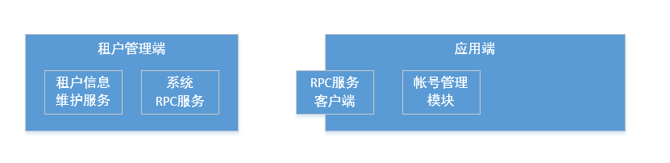
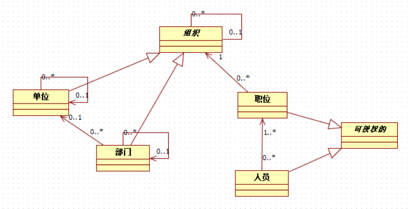

# CONCRETE-ACCOUNTS

Concrete-accounts面向concrete提供多种可扩展、开箱即用人员、账户管理模型。

## 多租户架构



## organization

### 模型

大致模型如下：



账户管理模块定义了两个角色，`SystemManager`-系统管理员，负责初始化系统、管理系统非业务设置；`OrgManager`-组织管理员，组织管理员角色需要赋予职位，从而确定账户可以管理哪些部门。

### 开箱即用

```xml
    <dependency>
        <groupId>org.coodex</groupId>
        <artifactId>concrete-accounts-organization-impl-reference</artifactId>
        <version>0.2.1-SNAPSHOT</version>
    </dependency>
```

Spring applicationContext配置参见`organization-impl-reference/src/test/resources/test.xml`和`organization-impl-reference/src/main/resources/spring_hibernate/accounts-organization.xml`

- 默认密码`p@55w0rd`，通过sha1散列
- 基于google-authenticator提供二步验证
- 参考实现中提供了一个基于Profile的系统管理员账户工厂
- 基于所有抽象模型提供一个最简实现


### 扩展

目前扩展设计为扩展各数据模型的属性，需要做的是：

1. 继承POJO模型，扩展相应属性
* 继承抽象实体或增加实体关系，扩展持久化模型
* 基于抽象接口定义具体接口，泛型参数使用具体模型，扩展其他业务所需的接口
* 根据POJO和实体的关系，扩展双向复制器(TwoWayCopier)
* 基于抽象的实现定义具体实现，泛型参数使用具体模型，实现扩展的接口
* 定义日志的渲染模式

关于登录的扩展：抽象实现中提供了基于手机号、email、身份证号的登录逻辑，可通过扩展 AbstractLoginServiceImpl的`protected PE getAccountEntityBy(String account)`实现

默认密码可以通过concrete.properties的defaultPassword重载，也可以通过实现并注册PasswordGenerator扩展


### google authenticator

totp.properties
```properties
# 容错范围，1-10，按照google authenticator的设计，30秒一个间隔，前后容错各fault.tolerance个间隔
fault.tolerance=10

#核发者
app.issuer.name=coodex.org 
# 服务器名
app.server.name=
```